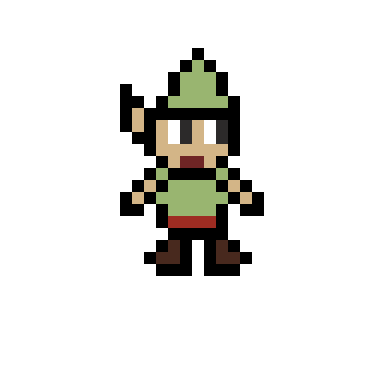
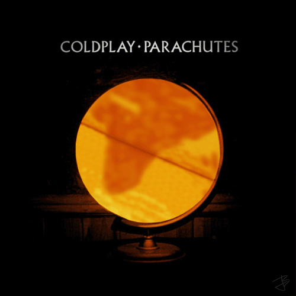
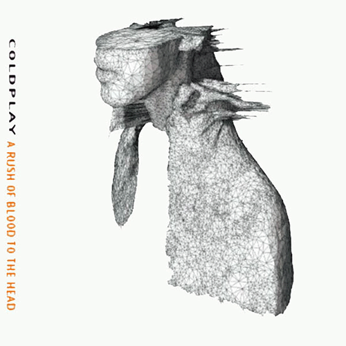
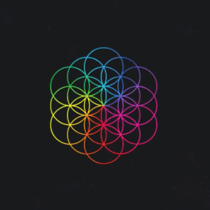
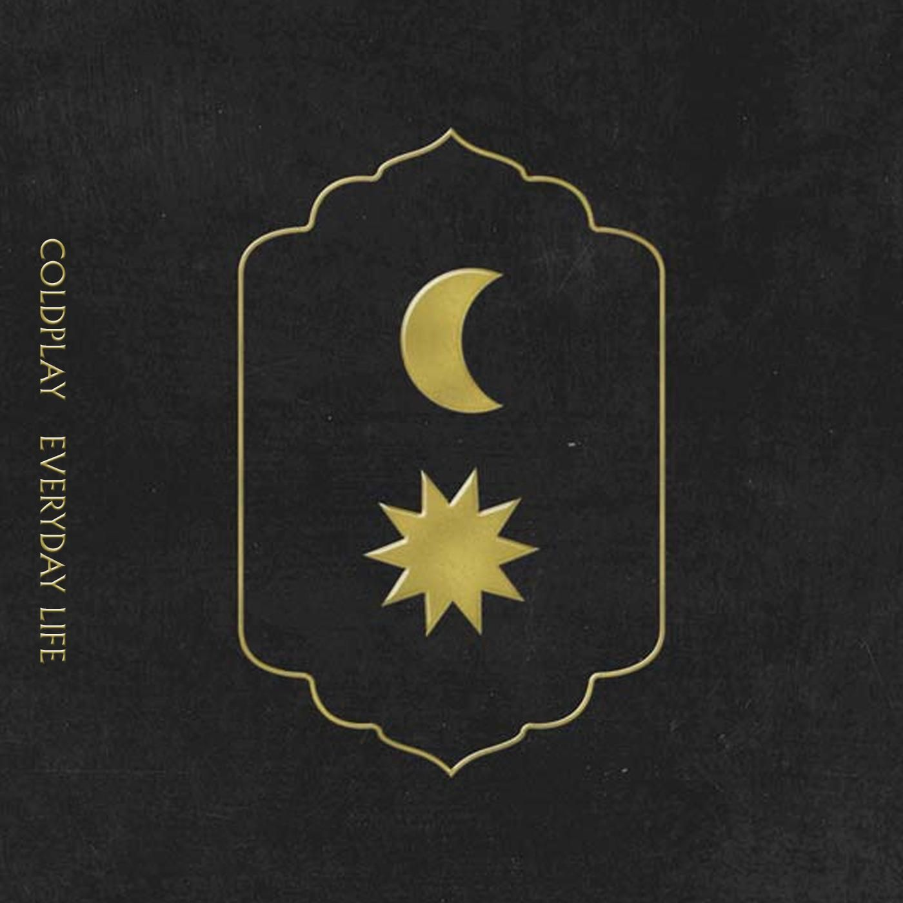

Being a tech enthusiast and a college student, my curiosity is sparked by the possibilities of technology and the open-source world. My current focus lies in full stack development, where I'm more inclined towards backend development and mobile side. Alongside my technical pursuits, I find pleasure in expressing myself creatively through writing blogs and practicing design. Engaging with podcasts and books is another cherished hobby of mine, as I love to expand my knowledge and gain valuable insights from diverse sources. My ultimate goal is to make valuable contributions to the tech community while gaining experience and seeking meaningful connections.

## Technologies

<table>
<tr>
	<td><strong>Web Development</strong></td>
	<td><strong>Design</strong></td>
</tr>
<tr>
		<td></td>
		<td></td>
</tr>
<tr>
	<td><strong>App Development</strong></td>
	<td><strong>Tools</strong></td>
</tr>
<tr>
	<td></td>
	<td></td>
</tr>
    <tr>
	<td><strong>Backend</strong></td>
</tr>
<tr>
	<td></td>
</tr>
</table>

## Github Achievements

## Github Stats

<!--
## **`Packages`**

- 🏰 [**`Palace`**](https://github.com/maxzod/palace) Dart HTTP server Framework built from scratch purly with Dart (WIP)
- 🏰 [**`Palace validators`**](https://github.com/maxzod/palace_validators) Input Validator classes for dart uses `dart:mirrors` ☯
- 👑 [**`Queen validators`**](https://github.com/maxzod/queen_validators) Input Validator classes for flutter to ease the use of TextFormFields
- 🔔 [**`Queen Alerts`**](https://github.com/maxzod/queen_alerts) Custom Toasts and popup for Flutter (WIP)
- ⚡  [**`Lighthouse`**](https://github.com/maxzod/lighthouse) CLI to provide hot reload commands for dart projects like `nodemon`
- 🦜 [**`queen UI`**](https://github.com/maxzod/queen_ui) Pre-Built Collections of Widgets and UI Components for Flutter
- ⚠  [**`EdgeAlerts`**](https://github.com/maxzod/EdgeAlerts) inspired by Alerter package for java
- 📃 [**`LaravelException`**](https://github.com/maxzod/laravel_exception) parse laravel exception messages to dart class with getters to make it easier
- 📃 [**`Queen Env`**](https://github.com/maxzod/queen_env) .env file reader
- 🔷 [**`Blueprint`**](https://github.com/maxzod/blueprint) validate JSON against your own Blueprint 🧬 -->

<!-- insert spotify icon below -->

## My Favorite albums

    

        
         
                
          
           
    

