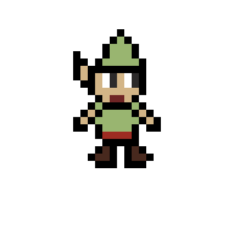
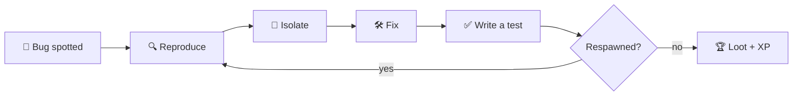
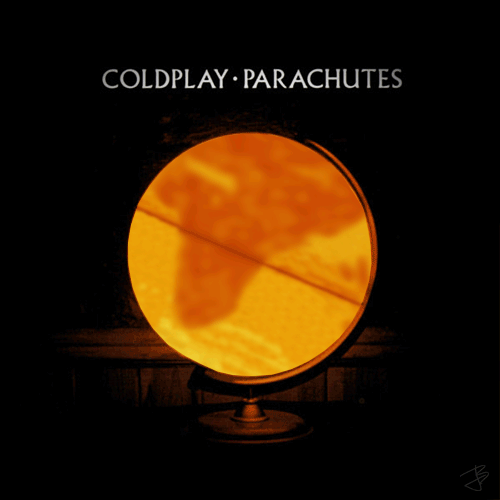
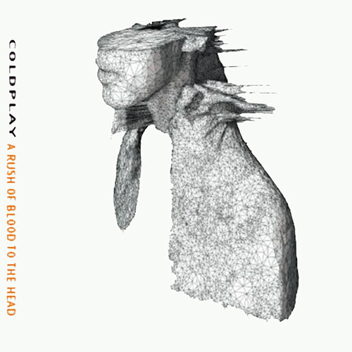
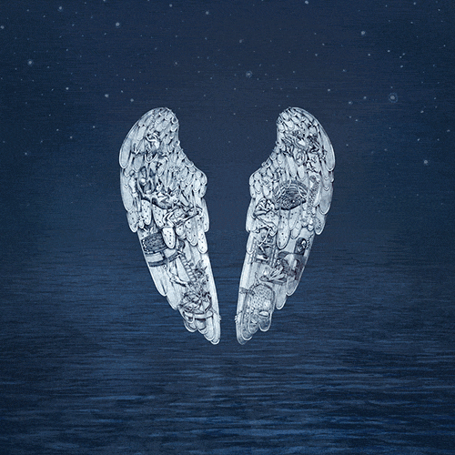
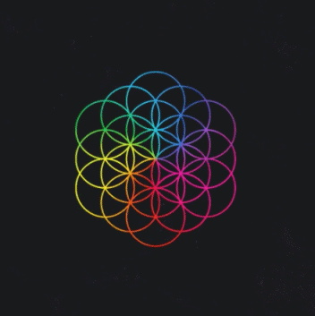
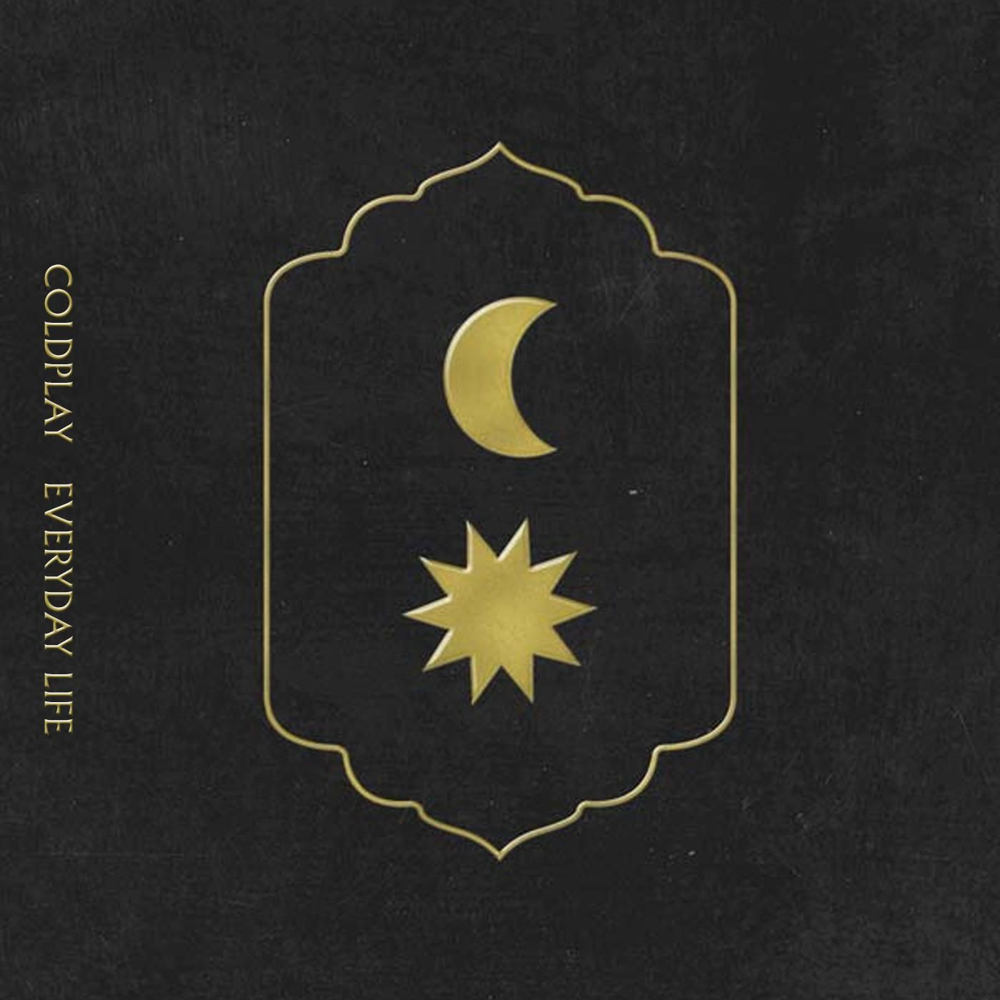

<div align="center">


<a href="https://github.com/SPiercer">
  
</a>


</div>


## 🧙 Character sheet

<table>
<tr>
<td width="38%" align="center">
  
  <br/>
  <sub><i>Player 1 has entered the dungeon</i></sub>
</td>
<td width="62%">

```text
┌─ PLAYER ───────────────────────────────────────
│ NAME ........... Nour Magdi  (aka SPiercer)
│ CLASS .......... Full-Stack Ranger
│ SUBCLASS ....... Founder / Software Lead
│ SPAWN POINT .... Cairo, Egypt
│ ALIGNMENT ...... Chaotic Shipper
├─ ATTRIBUTES ───────────────────────────────────
│ BACKEND   ██████████████████████████████░░  90
│ MOBILE    █████████████████████████████░░░  85
│ WEB       ███████████████████████████░░░░░  72
│ DEVOPS    ██████████████████████████████░░  88
│ DESIGN    ██████████████░░░░░░░░░░░░░░░░░░  55
│ HARDWARE  ██████████████████████░░░░░░░░░░  67 ⁶🤷⁷
├─ STATUS ───────────────────────────────────────
│ HP    ████████████████████  energy drinks: full
│ Mana  ███████████░░░░░░░░░  meetings drain it
└────────────────────────────────────────────────
```

</td>
</tr>
</table>

> **Lore.** A curious soul drawn to open source and the endless possibilities of tech.
> Wanders the full stack, but feels most at home in the backend caverns and the mobile highlands.
> Between battles: writes blogs, sketches designs, and levels up through podcasts and books.
> Ultimate goal: leave the tech community better than he found it, and make good allies along the way.


## 🗺️ Quest log

| | Quest | Role |
|:-:|---|---|
| ⚔️ | **[Fiftee](https://fiftee.com/en/)** — a sports coordination app | Founding Engineer, leading the party |
| 🏰 | **[Luminaya](https://luminaya.net/)** — my small software studio | Founder, client work and all the work :p |
| 🏗️ | **[bldrs.net](https://bldrs.net)** — networking for real estate, construction and supply | Founding engineer |
| 🛡️ | **[FlutterEgypt](https://www.facebook.com/groups/FlutterEgypt)** — the local guild & spawn point | Community organizer |

<details>
<summary><b>🧪 Side quests</b> (click to expand)</summary>
<br/>

- 🔌 Reverse-engineering a motorcycle speedometer
- 📟 Tinkering with ESP32 builds
- 🎹 Bard training on the piano
- ✍️ Writing blogs and practicing design
- 📚 Podcasts and books, for the XP

</details>


## 🎒 Inventory

<table>
<tr>
  <td><b>⚔️ Backend weapons</b></td>
  <td></td>
</tr>
<tr>
  <td><b>📱 Mobile spells</b></td>
  <td></td>
</tr>
<tr>
  <td><b>🌐 Web scrolls</b></td>
  <td></td>
</tr>
<tr>
  <td><b>☁️ Cloud relics</b></td>
  <td></td>
</tr>
<tr>
  <td><b>🎨 Artisan tools</b></td>
  <td></td>
</tr>
<tr>
  <td><b>🧰 Camp gear</b></td>
  <td></td>
</tr>
</table>


## 🐛 Bestiary

You were warned: the bugs are everywhere. Know your enemy.

| Creature | Habitat | Weakness |
|---|---|---|
| 👺 Off-by-One Goblin | Loops, pagination | Boundary tests |
| 👻 Race Condition Wraith | Async code, job queues | Locks, idempotency |
| 🐍 N+1 Hydra | ORMs | Eager loading, one good JOIN |
| 🧟 Null Zombie | Every API response | Strict types, null-safety |
| 🐉 Works-On-My-Machine Dragon | Prod | Docker, CI, humility |

<details>
<summary><b>⚔️ Battle loop</b> (click to expand)</summary>
<br/>


```mermaid
flowchart LR
    A[🐛 Bug spotted] --> B[🔍 Reproduce]
    B --> C[🧪 Isolate]
    C --> D[🛠️ Fix]
    D --> E[✅ Write a test]
    E --> F{Respawned?}
    F -- yes --> B
    F -- no --> G[🏆 Loot + XP]
```

</details>


## 🏆 Achievements unlocked

<div align="center">


</div>


## 🎵 Tavern jukebox

<p align="center">
  
  
  
  
  
</p>


<div align="center">

## 💾 Save point

Found a bug? Open an issue. Want to join the party? Fork a repo and send a PR.

<!-- Add your contact badges here, e.g. LinkedIn / X / email -->

<a href="https://github.com/SPiercer?tab=followers">
  
</a>

<br/><br/>

<sub>Game saved. Thanks for playing.</sub>

</div>


